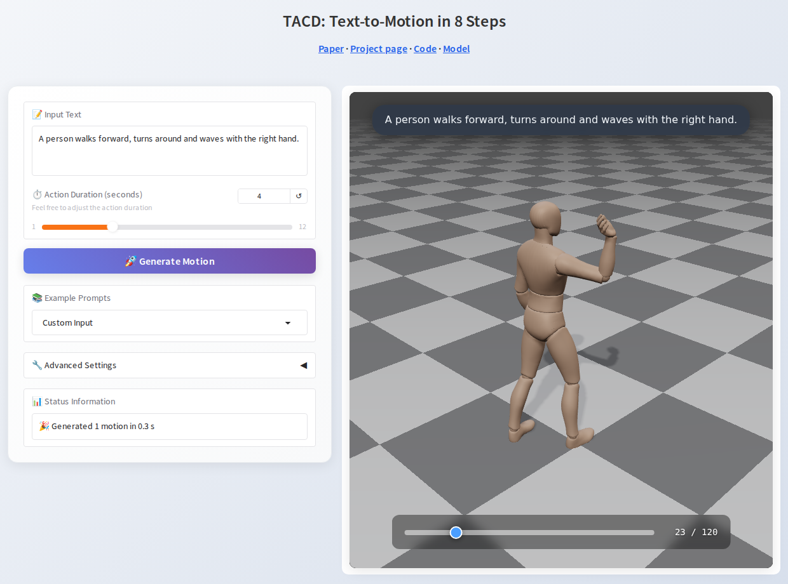

# TACD: Distilling Efficient Text-to-Motion Models via Terminal Amplification Control

📄 Paper: [https://arxiv.org/abs/2610.02867](https://arxiv.org/abs/2610.02867)

🌐 Project page: [https://vkgo.github.io/TACD/](https://vkgo.github.io/TACD/)

🤗 Model: [https://huggingface.co/weijinhuang/TACD-HY-Motion-Lite](https://huggingface.co/weijinhuang/TACD-HY-Motion-Lite)

Text-to-motion in 8 sampling steps, distilled on-policy from HY-Motion 1.0 without motion data.

- <u>**268 ms per motion and 2.62 GB peak GPU memory in bf16**</u>, vs 2077 ms and 17.63 GB for the
  50-step HY-Motion 1.0 teacher: <u>**7.7× faster, 6.7× less memory**</u> (RTX L40, batch 1)
- 465M HY-Motion-1.0-Lite denoiser with a Qwen3-0.6B text encoder

## Quick start

One Python 3.12 environment covers the model, the demo and the humanoid server:

```bash
git clone https://github.com/vkgo/TACD && cd TACD
pip install --index-url https://download.pytorch.org/whl/cu129 torch==2.8.0   # or the CPU build of torch 2.8.0
pip install -r requirements.txt
hf auth login   # the model is gated: accept its licence on the model page first
```

```python
import torch
from transformers import AutoModel

model = AutoModel.from_pretrained("weijinhuang/TACD-HY-Motion-Lite", trust_remote_code=True)
model = model.to("cuda").eval()   # or .to("cuda", torch.bfloat16) for bf16

out = model.generate(["a person walks forward, turns around and waves"], duration=4.0, seed=0)
out.joints   # (1, 120, 22, 3) joint positions in metres, 30 fps
out.rot6d    # (1, 120, 22, 6) local joint rotations
out.transl   # (1, 120, 3)     root translation
```

## Visualize

**Web demo.** Type a sentence, set the duration, and the motion plays in a 3D viewer (drag to rotate,
scroll to zoom); several seeds show several motions side by side.

```bash
python demo/app.py            # open http://localhost:7860
```



`--share` adds a temporary public link, `--host 0.0.0.0` serves other machines, `--device cpu` runs
without a GPU (about 20 s per 4-second motion on two CPU cores).

**HTML file.** Write motions to one HTML file and open it in a browser:

```bash
python demo/visualize.py "a person walks forward, turns around and waves" --duration 5 --seeds 0,1 --out walk.html
```

or, for motions generated in your own code:

```python
import sys; sys.path.insert(0, "demo")
from visualize import save_html

out = model.generate(["a person jumps twice"], duration=4.0, seed=[0, 1])
save_html(out, "a person jumps twice", "jump.html")
```

The viewer loads three.js and the character model from public CDNs, so the browser needs an internet
connection.

## Repository layout

| path | contents |
|---|---|
| `hf_repo/` | code, config and model card of the Hugging Face model (weights are on the Hub) |
| `demo/` | web demo and HTML export with a 3D viewer |
| `humanoid/` | text-to-humanoid application: TACD + retargeting + streaming to a G1 controller |
| `tools/` | smoke test of the Hugging Face model in a fresh environment |

## Results

HumanML3D test set:

| | R@1 ↑ | R@3 ↑ | MM-Dist ↓ | FID ↓ |
|---|---|---|---|---|
| HY-Motion 1.0 teacher @ 8 steps | 0.378 | 0.652 | 4.225 | 3.250 |
| **TACD @ 8 steps** | **0.479** | **0.782** | **3.192** | **1.041** |

## Humanoid

[`humanoid/`](humanoid) drives a Unitree G1 from text: a resident server generates with TACD, retargets
with UMR and streams the motion to NVIDIA's SONIC controller; type a prompt, press Enter. See
[`humanoid/README.md`](humanoid/README.md).

## License

The code in this repository is released under the [Apache License 2.0](LICENSE), except:

- the model weights and the files in `hf_repo/`, which contain Tencent HY-Motion 1.0 code, are released
  under the Tencent HY-MOTION 1.0 Community License Agreement ([`hf_repo/LICENSE`](hf_repo/LICENSE));
- `demo/` contains code from the Tencent HY-Motion-1.0 Space, under the same Tencent agreement
  ([`demo/NOTICE`](demo/NOTICE));
- third-party files in `humanoid/` keep their licences ([`humanoid/THIRD_PARTY.md`](humanoid/THIRD_PARTY.md)).

Tencent HY-MOTION 1.0 is licensed under the Tencent HY-MOTION 1.0 Community License Agreement,
Copyright © 2025 Tencent. All Rights Reserved. The trademark rights of “Tencent HY” are owned by
Tencent or its affiliate. Powered by Tencent HY.

## Citation

```bibtex
@article{huang2026tacd,
  title   = {TACD: Distilling Efficient Text-to-Motion Models via Terminal Amplification Control},
  author  = {Huang, Wei-Jin and Li, Yuan-Ming and Lin, Kun-Yu and Luo, Wang and Zhu, Yinlin and
             Yu, Yue and Ye, Shenghao and Yuan, Junbin and Hong, Fa-Ting and Zhang, Qing and Zheng, Wei-Shi},
  journal = {arXiv preprint arXiv:2610.02867},
  year    = {2026}
}
```
